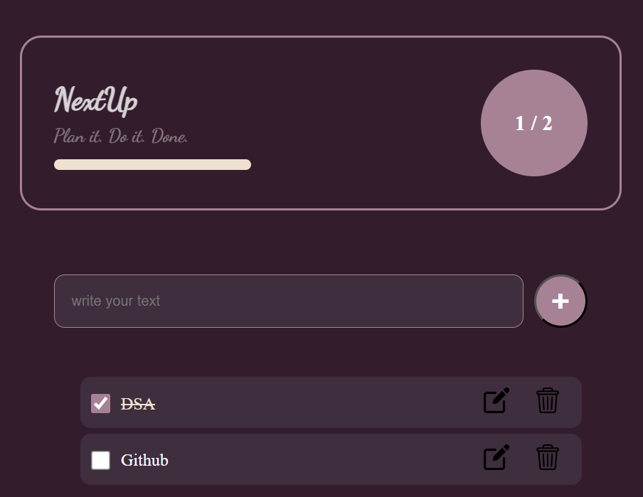
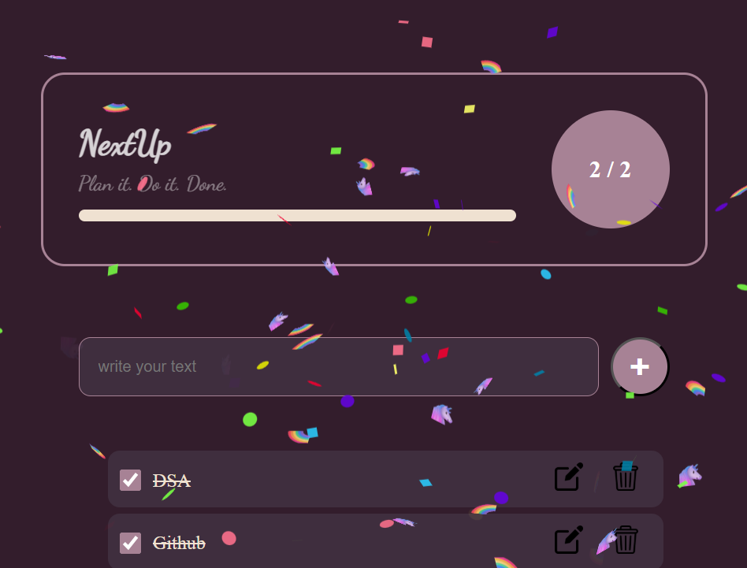

# NextUp
NextUp helps you stay organized with a simple and elegant ToDo list.
Sure! Here's a complete, polished `README.md` file for your **NextUp** ToDo App. This version is ideal for showcasing on **GitHub**, your **portfolio**, or in a **project submission**:

---

## 📝 NextUp – Minimalist ToDo App

> **Plan it. Do it. Done.**
> A simple, elegant ToDo app to keep you productive and motivated.

---

### 📌 Overview

**NextUp** is a clean and stylish task management app designed to help users organize their day, track completed tasks, and visualize progress. Whether you're managing daily chores or personal goals, NextUp makes it easy and motivating to stay on track.

---

### ✨ Features

* ✅ Add, edit, delete tasks
* Mark tasks as complete/incomplete
* Progress bar showing completion ratio
* Responsive layout and dark theme
* Stylish icons for edit and delete actions

---

### 📸 Preview




---

### 🚀 Technologies Used

* **HTML5** – Structure
* **CSS3** – Styling and responsive layout
* **JavaScript (Vanilla)** – Core logic & interactivity
* **Google Fonts** – Typography (`Dancing Script`)

---

### 🛠️ Setup Instructions

1. Clone the repository:

   ```bash
   git clone https://github.com/your-username/nextup-todo-app.git
   cd nextup-todo-app
   ```

2. Open `index.html` in your browser:

   ```bash
   start index.html
   ```

3. Start adding tasks and get productive!

---

### 📂 Folder Structure

```
📁 NextUp/
│
├── index.html
├── style.css
├── app.js
└── img/
    ├── edit.png
    └── bin.png
```

---

### ✍️ Author

**Srishti Srivastava**


